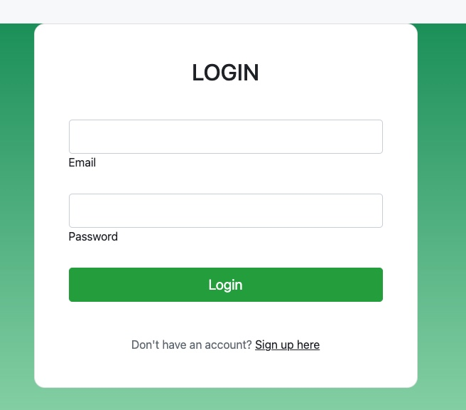
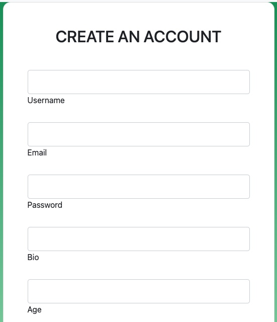
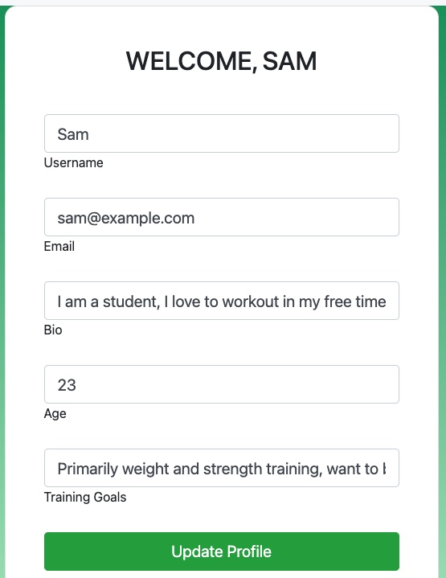
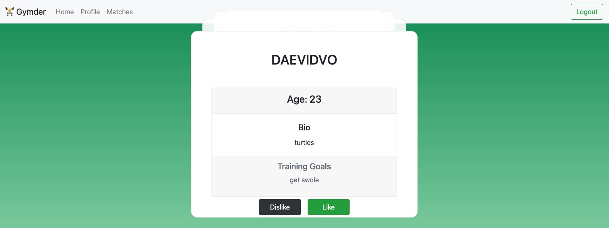
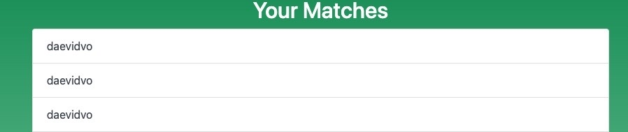
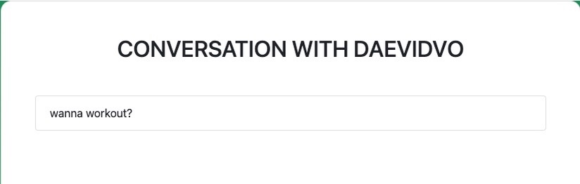
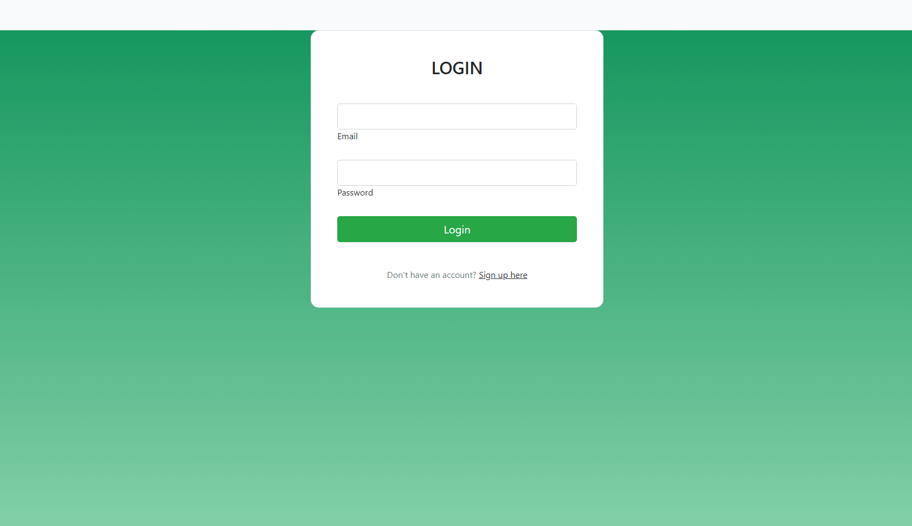

# Gymder

## Overview

[Visit the Deployed Site](https://gymder-dv-sh-kp.herokuapp.com/ )

Finding a workout partner can often be difficult and scary for some people. Gymder combats this problem by offering an application that can assist with finding and connecting you with potential gym partners. Simply create a profile and enter your bio and your training goals and match with other users you feel have similar goals.

## Table of Contents 

* [User Story](#user-story)
* [APIs](#apis)
* [Models](#models)
* [GET/POST Routes](#get-post-routes)
* [Socket.IO](#socket)
* [Usage](#usage)
* [Learning Objectives](#learning-objectives)
* [Learning Points](#learning-points)
* [Contributors](#contributors)

## Technologies Used


* [HTML](https://developer.mozilla.org/en-US/docs/Web/HTML)
* [CSS](https://developer.mozilla.org/en-US/docs/Web/CSS)      
* [Git](https://git-scm.com/)   
* [Express](https://www.npmjs.com/package/express-handlebars)
* [JavaScript](https://www.javascript.com/)    
* [Node.js](https://nodejs.org/en)
* [Heroku](https://devcenter.heroku.com/articles/heroku-cli)
* [Sequalize](https://sequelize.org/)
* [mysql2](https://www.npmjs.com/package/mysql2)
* [dotenv](https://www.npmjs.com/package/dotenv)
* [express Handlebars](https://www.npmjs.com/package/express-session)
* [express-sessions](https://www.npmjs.com/package/connect-session-sequelize )
* [bcrypt](https://www.npmjs.com/package/bcrypt)
* [Node](https://socket.io/)
* [nodemon](https://www.npmjs.com/package/nodemon)
* [NPM](https://www.npmjs.com/)
* [Bootstrap](https://getbootstrap.com/docs/4.1/getting-started/introduction/)
* [Hammer.js](https://hammerjs.github.io/)
* [Socket.IO](https://socket.io/)


## User Story

As a User I want o see a login or signup form <br/>
So that I can access the site



As a User I want to submit my user info <br/>
So that I can create an account 




As a User I want to be able to view potential gym partners on this app <br/>
So I can see if I want to train with them



As a User I want to be able to match with my gym partners <br/>
So I can contact them to coordinate gym sessions





## Models

One of the first steps in our project was creating the models. This was so we can see the rules for features such as our user accounts, messages, and matches.


How we created our Models for matches and users:
```javascript
  Matches.init(
    {
        id: {
            type: DataTypes.INTEGER,
            allowNull: false,
            primaryKey: true,
            autoIncrement: true,
        },
        user_id: {
            type: DataTypes.INTEGER,
            references: {
                model: User,
                key: 'id',
            },
        },
```

## GET POST Routes
We then created GET and POST routes for API and HTML features such as retrieving message data, users being able to edit their profiles, log in or signup, and much more.


How we used GET/POST route for matches:
```javascript
   ponse = JSO// Get all matches
router.get('/', async (req, res) => {
    try {
      // Get the current user's ID from their session
      const currentUserId = req.session.id;
      
      const matchData = await Matches.findAll({
        where: {
           user1Id: currentUserId,
           user2Id: req.body.user2Id
        },
        include: [
          {
            model: User,
            as: 'user1',
            attributes: ['id', 'username']
          },
          {
            model: User,
            as: 'user2',
            attributes: ['id', 'username']
          }
        ]
      });
      res.status(200).json(matchData);
    } catch (err) {
      res.status(500).json(err);
    }
  });
```


## Socket
```javascript
   var tile = $('<div class="column is-one-third is-flex">');
    var box = $('<article class="tile is-child box has-background-danger is-align-items-center">');
    var title = $('<p class="title has-text-light">').text(movie.title);
    var year = $('<p class="has-text-light">').text('Year: ' + movie.year);
    var overview = $('<p class="has-text-light">').text (movie.overview);
    var image = $('').attr('src', movie.posterURLs['185']);
```
In the above code we .


## Usage 

Navigate to the site using the link at the top of this README. Once there create an account and enter your name, age, email, a password, a short bio, and your training goals. After that, you will be relocated to the home page where you may begin liking other users. Simply click like or dislike, or swipe the user card to the right to like or left to dislike them. If users both like each other then they can message each other by navigating to the matches page and clicking on that user. From there you may send messages to each other.



## Learning Objectives
1. Applying and solidifying programming fundamentals: The project week is an opportunity for students to put into practice the foundational skills they have learned throughout the bootcamp, such as HTML, CSS, and JavaScript.
2. Working in teams: Many project weeks are designed to simulate real-world development scenarios where students work collaboratively in teams to build a web application. Learning how to work with others in a development environment is an important skill for any aspiring web developer.
3. Developing problem-solving skills: Building a web application requires the ability to solve complex problems and troubleshoot issues that arise. Project weeks challenge students to identify and overcome roadblocks and find creative solutions to technical challenges.
4. Using new technologies: Project weeks often introduce students to new technologies or frameworks that they may not have used before. This can be an opportunity to expand their skillset and learn about the latest tools and techniques in web development.
5. Building a portfolio: The web application that students create during project week can be used as a portfolio piece to showcase their skills and experience to potential employers. Learning how to build a polished and functional web application is a valuable asset for any developer.

## Learning Points:

We learned how to better utilize models and GET/POST routes to better suite our needs and adjust them accordingly whenever we ran into an error. We also learned about new technologies in Socket.IO and Hammer.js which will both be very useful for upcoming projects. We also got more experience working together as a team to not only code and pair programs together but to work on ideas and plan efficiently.

## Contributors

[David Vo](https://github.com/daevidvo) <br />
[Kaiden Parcher](https://github.com/Kaidenparcher) <br />
[Sam Higa](https://github.com/samhiga) <br/>